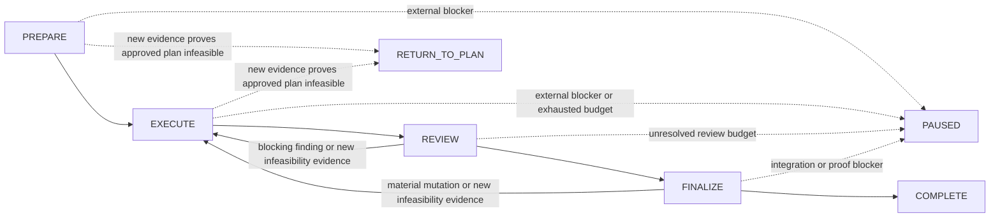

# Ralph v2 Greenfield Rewrite Plan

> Status: PROPOSAL — implementation-ready plan, not yet approved or executed.
> Date: 2026-07-14.
> Scope: add an explicit-invocation `ralph-v2` preview beside legacy Ralph.
> Strategy: greenfield rewrite. Legacy Ralph is a semantic inventory and
> compatibility baseline, not a text or structure template.

## 1. Goal

Create a smaller, self-contained Ralph v2 that preserves Ralph's useful
execution philosophy while replacing its long prose loop, mandatory external
document reads, duplicate ledgers, and hook-injected runtime guidance with a
four-state development loop:



The generated platform skill document must be sufficient to run the normal,
failure, pause/resume, review-remediation, and delivery paths without reading
another repository document.

### Canonical transition matrix

Only the following state transitions and outcomes are legal. Task updates
inside one state are not state transitions.

| From | To | Guard |
|---|---|---|
| `PREPARE` | `EXECUTE` | Contract, worktree, evidence plan, budgets, and delivery owner are executable and persisted |
| `PREPARE` | `PAUSED` | A resolvable external input, permission, environment, or user-decision blocker prevents safe execution |
| `PREPARE` | `RETURN_TO_PLAN` | New repository/runtime evidence proves the approved plan infeasible under the approved Direction |
| `EXECUTE` | `REVIEW` | Every required task has fresh focused evidence and the final budget checkpoint passes |
| `EXECUTE` | `PAUSED` | An external blocker or exhausted bounded attempt budget prevents further safe progress |
| `EXECUTE` | `RETURN_TO_PLAN` | New repository/runtime evidence proves the approved plan infeasible under the approved Direction |
| `REVIEW` | `EXECUTE` | A material in-scope blocker requires mutation, or new infeasibility evidence requires evaluation under the terminal predicate; intersecting assurance is invalidated |
| `REVIEW` | `FINALIZE` | Required review is satisfied for the frozen revision with no unresolved material blocker |
| `REVIEW` | `PAUSED` | Required review cannot finish or its bounded remediation budget is exhausted |
| `FINALIZE` | `EXECUTE` | Cleanup, verifier correction, regeneration, conflict resolution, another material mutation, or new infeasibility evidence requires re-evaluation and invalidates assurance |
| `FINALIZE` | `COMPLETE` | Verification, delivery, post-integration proof, and completion audit all pass for the current revision |
| `FINALIZE` | `PAUSED` | Integration or required proof cannot safely finish without an external change |
| `PAUSED` | preserved active `phase` | The same run revalidates that the recorded blocker is resolved, clears only `outcome`, and preserves revision/tasks/budgets |

`RETURN_TO_PLAN` means **replanning required**, not automatic return or
automatic Ralplan invocation. It is a terminal Ralph v2 outcome. It is allowed
only when evidence discovered after plan approval proves that the approved
Direction cannot satisfy an active AC, scope boundary, constraint, or safety
invariant. Implementation preference, a potentially better design, minor
file/function differences, and ordinary uncertainty do not qualify. A
temporarily resolvable input, permission, environment, or user-decision blocker
produces `PAUSED`. If the infeasibility is first discovered in `REVIEW` or
`FINALIZE`, invalidate the affected assurance, return to `EXECUTE`, and apply
the same terminal predicate there. Report the evidence and reason, then stop;
do not invoke Ralplan.

## 2. Fixed Product Decisions

1. Ralph v2 is a new public preview, not an incremental edit to `ralph`.
2. Legacy Ralph remains installed, routed, and behaviorally unchanged.
3. Ralph v2 is explicit-invocation-only during evaluation.
4. The only active states are `PREPARE`, `EXECUTE`, `REVIEW`, and `FINALIZE`.
5. Invocation outcomes are `COMPLETE`, `PAUSED`, and `RETURN_TO_PLAN`.
   `COMPLETE` and `RETURN_TO_PLAN` are immutable terminal outcomes. `PAUSED` is
   resumable: resume keeps the same run ID, phase, revision, tasks, and budgets
   and clears only the outcome after blocker revalidation.
6. Runtime composition is exactly one self-contained core plus one platform
   adapter.
7. Runtime Required Reading is empty. Shared, platform-maintenance, agent-core,
   and other skill documents are not runtime prerequisites.
8. Ralph v2 uses no hook for routing, platform selection, agent preparation,
   policy injection, state management, continuation, or completion.
9. The existing V1 Ralph prompt hook may receive one narrow negative guard so
   `ralph-v2` produces no V1 adapter injection. This is contamination
   prevention, not a Ralph v2 runtime dependency.
10. Registered role agents keep their own full role instructions. The parent
    core owns workflow state and sends only the bounded task packet.
11. The model owns one current run snapshot, including a compact append-only
    transition list used for resume and declared-state validation. The live
    harness owns observation of actual host/tool events; the model does not
    author a second event log, and its transition list is never behavioral
    proof by itself.
12. Static and live gates validate artifacts, event ordering, Git/filesystem
    facts, and role identity. Final prose and marker phrases are not behavioral
    proof.

## 3. Non-Goals

- Do not shorten, reorganize, or patch the legacy `ralph.md` as the v2 design.
- Do not copy legacy headings, Required Reading tables, ledger templates, or
  platform prose into v2.
- Do not make PRD, progress, and verification files three competing state
  owners.
- Do not add a daemon, hidden controller, Stop hook, keyword mode, or external
  state service.
- Do not add paired review, cross-host review transport, automatic rescue,
  mandatory multi-view cleanup, or unconditional broad suites to the initial
  preview.
- Do not migrate exact validator phrases or output markers merely because V1
  tests currently recognize them.
- Do not rewrite existing agent prompts unless a real live scenario proves the
  existing role output cannot satisfy the new bounded packet contract.
- Do not redesign Interview, Ralplan, or Ultrawork beyond a later explicit v2
  handoff boundary.
- Do not automatically invoke Ralplan after `RETURN_TO_PLAN`; report why
  replanning is required and terminate Ralph v2.

## 4. Acceptance Criteria

### AC-1 — Minimal state model

- The core defines exactly four active states and three outcomes.
- The canonical transition matrix is exhaustive; every legal transition and
  loop-back is explicit.
- Every omitted transition is illegal.
- `COMPLETE` is reachable only from `FINALIZE`.
- A material mutation during `REVIEW` or `FINALIZE` can continue only through
  `EXECUTE` with non-empty invalidation metadata.
- `RETURN_TO_PLAN` is reachable from `PREPARE` or `EXECUTE` only with new
  repository/runtime evidence satisfying the replanning-required predicate.
- `PAUSED` resume preserves the same run identity, active phase, revision,
  tasks, and charged budgets.

### AC-2 — Self-contained runtime

- Codex wrapper composition is `ralph-v2 core + Codex adapter`.
- Claude wrapper composition is `ralph-v2 core + Claude adapter`.
- Neither wrapper embeds a common platform runtime.
- Neither wrapper instructs the parent to read `docs/shared/*`, long platform
  documents, agent-core documents, or another skill document.
- Missing maintenance/reference documents do not block execution.

### AC-3 — Safe preparation

Before the first source mutation, the run records:

- approved requirements source, Direction Contract, and stable AC IDs;
- named semantic risks and the exact procedures each risk activates;
- worktree decision and location;
- delivery/integration owner;
- allowed and protected scope;
- task/evidence plan;
- retry, review, verifier, broad-suite, and scope-growth budgets;
- accessible approved input artifact inside or from the worktree.

### AC-4 — Reliable task loop

Each behavior-changing task follows:

```text
scope and contract surface
-> TDD classification
-> write exactly one active RED
-> execute it before production mutation
-> observe and record failure for the expected semantic reason
-> minimal implementation
-> GREEN
-> risk-triggered negative/boundary case
-> nearby baseline
-> focused real-surface evidence
-> scope/freshness/budget check
-> verified
```

Non-behavioral work records a specific TDD exception before editing.
At most one new behavioral contract may be under active RED/GREEN development
at a time. Make it GREEN and run its nearby regression before activating the
next contract. A later negative or boundary case that asserts new behavior
must observe its own RED before the corresponding production change.
Behavior-changing RED/GREEN slices are serialized even when parallel execution
is authorized. Parallel work is limited to independent non-behavioral slices or
evidence commands for already-closed contracts.

### AC-5 — Test quality

- RED fails against old or wrong behavior for the expected reason.
- The test crosses the real caller/public/runtime contract surface where
  practical.
- Named risks activate the smallest relevant negative, forbidden-behavior,
  lifecycle, stale-state, boundary, or adversarial case.
- Marker-only, status-only, mock-bypassed, broad snapshot, and
  implementation-mirroring tests do not count as semantic proof.
- A verifier independently audits whether maker-authored tests would reject a
  plausible wrong implementation and whether any TDD exception was legitimate.

### AC-6 — Review and verifier ordering

- Required code review finishes and its output is captured before verifier
  dispatch.
- Blocking findings are resolved or recorded as blocking before verifier
  eligibility.
- Verifier is one independent self-host pass per stable reviewed revision,
  never the maker and never a pair.
- An early verifier result is stale and cannot count.

### AC-7 — Mutation invalidation

- Every material mutation increments the run revision.
- Evidence names the revision and affected scope it proves.
- Cleanup, blocker fixes, conflict resolution, regeneration, merge changes, or
  dependency changes invalidate only intersecting evidence and assurance.
- Untouched evidence remains reusable.

### AC-8 — Bounded recovery

- Same-root implementation/debugging attempts and review rounds persist across
  compaction and pause/resume.
- Exhaustion yields `PAUSED`. `RETURN_TO_PLAN` requires new repository/runtime
  evidence proving that the approved Direction cannot satisfy an active AC,
  scope boundary, constraint, or safety invariant; exhaustion alone is never
  enough.
- Budget exhaustion never authorizes automatic scope or process expansion.
- Resume reconciles the snapshot against Git/worktree facts before reusing
  tasks, counters, evidence, review, or verifier state.

### AC-9 — Delivery and completion

- Exactly one owner is responsible for merge-back or branch/PR handoff.
- Direct Ralph delivery requires post-integration proof or an explicit
  downstream handoff obligation.
- A resolvable merge conflict requiring mutation preserves the worktree and
  returns to `EXECUTE`; an external or safely unresolvable merge/post-merge
  failure preserves the worktree and yields `PAUSED`.
- Optional stronger proof or non-blocking follow-up cannot prolong a run whose
  required completion criteria already pass.
- Ralph v2 reports residual risk and stops. It does not auto-invoke another
  workflow.

### AC-10 — Host independence

- Codex and Claude use the same core semantics.
- Adapters own only invocation, wait/capture/cleanup primitives, registered
  identity, confirmed-unavailable fallback, user interaction, and optional
  host-specific transport required for normal single-host role execution.
- Hook-disabled and no-hook-injection lanes both complete the normal loop.

## 5. Selected V1 Semantics To Preserve

Only V1 rules with a clear failure-prevention or proportionality benefit enter
the new runtime core.

| ID | Preserve | Why it matters | V2 owner |
|---|---|---|---|
| V1-01 | Approved plan/spec remains accessible after moving to a worktree | Untracked `.oh-no` artifacts do not automatically appear in a new Git worktree; losing the approved input causes memory-based improvisation | `PREPARE` entry guard |
| V1-02 | Measurable signals are evidence, not acceptance criteria | Prevents optimizing prompts and patches for fixtures, markers, counters, hidden-check guesses, or local metric movement | Global evidence invariant |
| V1-03 | Semantic change, not category words, activates risk procedures | `concurrency` and `generated` must not activate stronger isolation/review/testing unless ownership/lifecycle/safety or generation-contract semantics actually change | `PREPARE` risk activator |
| V1-04 | Nearby baseline complements new tests | Maker-written tests may share the implementation's misconception; a nearby existing smoke/baseline catches hidden regression | `EXECUTE` task loop |
| V1-05 | Successful status without requested observable effect is missing evidence | Rejects exit-0, HTTP-2xx, done-log, or child-completed false positives | Evidence and finalization invariant |
| V1-06 | Reviewer findings outside approved scope remain follow-ups | Prevents review-driven scope ratcheting and speculative cleanup | `REVIEW` finding predicate |
| V1-07 | Failed executor output may contain partial changes | Prevents duplicate implementation, overwrites, and unsafe fallback after transport failure | `EXECUTE` child failure handler |
| V1-08 | Each executor result receives an owned-scope integration check | Final review alone cannot prove each parallel slice stayed confined | `EXECUTE` batch integration guard |
| V1-09 | Authorized current-checkout execution stops on risk escalation | Prevents a narrow low-risk carve-out from silently becoming broader or riskier editing in the integration checkout | `EXECUTE` escalation guard |
| V1-10 | Broad suites run once after stabilization and noisy suites yield to smaller semantic checks | Prevents repeated expensive commands from replacing direct evidence | Budget and `FINALIZE` procedure |
| V1-11 | Process-growth tripwires force rescope rather than authorize more machinery | Controls test-harness inflation, repeated abstractions, generated/handwritten drift, and broad patch growth | Persistent budget checkpoints |
| V1-12 | Optional cleanup and non-blocking follow-ups do not extend a satisfied run | Gives Ralph a real terminal condition and prevents perfection loops | `FINALIZE -> COMPLETE` guard |

### V1-01 — Artifact handoff rule

Before `PREPARE -> EXECUTE`, choose one:

```text
- copy the approved artifact into the task worktree;
- retain a validated absolute source reference;
- preserve the approved task definition in the run record.
```

The model must not assume untracked `.oh-no` artifacts exist in another
worktree.

### V1-02 — Anti-gaming validation rule

```text
Metrics, snapshots, markers, broad-suite status, sampled traces, and synthetic
scenarios may diagnose a failure category. They do not redefine success.

Reject task-name, fixture-name, issue-id, dataset-label, environment-specific,
or unseen-check-guessing guidance unless it is itself an approved product
requirement.
```

### V1-03 — Proportional risk-activation rule

```text
Concurrency activates stronger isolation, review, or tests only when ordering,
ownership, lifecycle, idempotency, or safety semantics change.

Generated output activates stronger procedures only when the generation
contract changes, generated output is hand-edited, or handwritten source and
generated output disagree. Mechanical regeneration is not sufficient.
```

### V1-06 — Reviewer blocker predicate

A finding may force mutation only when the smallest correction prevents
material failure of an active AC, approved constraint, safety invariant,
public contract, regression caused by this patch, or fired mandatory gate.
Preferences, future-proofing, unrelated cleanup, and optional stronger proof
are residual follow-ups.

### V1-07/V1-08 — Child integration rule

For every executor result, including a final failure:

```text
1. wait for final status unless explicitly cancelled or invalidated;
2. capture result and observed changed-file set;
3. inspect partial changes before retry or inline fallback;
4. verify files stay within owned scope;
5. verify the assigned slice is satisfied or explicitly failed;
6. detect conflicts with other slices;
7. use, reject, or preserve the result deliberately;
8. clean up only after the disposition is recorded.
```

Pending work is never duplicated merely because a wait timed out or returned
empty.

### V1-09 — Current-checkout escalation rule

When a run authorized for narrow current-checkout editing gains a new semantic
risk or exceeds its approved scope:

```text
stop further mutation;
record landed changes and invalidated evidence;
move future edits to a registered task worktree, obtain explicit current-
checkout authorization, or set PAUSED.
```

### V1-10/V1-11 — Budget checkpoints

One persistent budget has two checkpoints:

1. cumulative after every task;
2. final before `EXECUTE -> REVIEW`.

Default rescope signals:

- actual handwritten scope exceeds roughly twice the estimate;
- supporting tests/validation grow to roughly three times the product or
  source-contract change;
- the same invariant is being implemented a third time;
- generated output hides unexpectedly broad handwritten changes;
- more than 20 changed files or 500 insertions without explicit scope/evidence
  justification;
- multiple packages or more than three public subsystems change without an
  explicit AC-to-evidence map.

These are rescope signals, not permission to remove required safety tests or
automatically grow proof machinery.

## 6. Conditional V1 Semantics

These are included only when their named trigger fires.

### Small-task review waiver

Review may be `not-required` only when all are true:

- the final edit remains tightly bounded;
- an existing check distinguishes old and requested behavior;
- root cause and contract surface are known;
- no security, data, permission, public-contract, migration, new-dependency,
  shared-schema, generated-contract, release, or concurrency-semantics risk is
  active;
- the final diff still satisfies the predicate.

An unexpected file, surface, test-infrastructure addition, or semantic risk
invalidates the carve-out and requires ordinary review.

## 7. V1 Semantics Deliberately Not Migrated

| Omitted V1 structure | Replacement |
|---|---|
| Required Reading table and runtime shared-document loading | Self-contained core with each retained invariant stated once |
| `prd.json`, `progress.md`, and `verification.md` as parallel state representations | One versioned run snapshot plus referenced evidence artifacts |
| Seven-field Review Gate dependency graph | Structural `REVIEW -> FINALIZE -> verifier` ordering and host-event validation |
| Repeated review/verifier lifecycle prose | One global lifecycle invariant and adapter API mapping |
| Long per-story Input Hardening template | Compact task record with AC, scope, TDD, evidence, revision, and status |
| Separate process-budget and diff-budget state machines | One budget with cumulative and pre-review checkpoints |
| Eight-value worktree enum | `isolated(path)`, `current-checkout(reason)`, `read-only`, `blocked` |
| Four-value parallel-trigger enum | `authorized(source)` or `disabled(reason)` |
| Hook-injected platform adapter | Generated platform adapter only; no v2 hook behavior |
| Common platform runtime | Required skill-specific adapter only |
| Exact marker/phrase validation | Schema, tool-event, Git, filesystem, and artifact validation |
| Agent installation/model/effort detail in skill prompt | Host registration and release tooling |
| Full role prompt embedding in the normal parent path | Registered role prompt plus bounded task packet |
| Codex executor transport sentinel protocol | Not supported in the initial preview; add later only with a dedicated adapter contract and live evidence |
| Paired review and cross-host review transport | Defer until the four-state single-review loop is stable and a dedicated adapter contract plus live evidence justifies the extra branch |
| Automatic or built-in rescue analysis | Exhaust the bounded ordinary attempt budget and yield `PAUSED`; add rescue later only with evidence that it changes outcomes without growing loops |
| Mandatory multi-view cleanup | Candidate-driven cleanup inside `FINALIZE` |
| Automatic chaining after Ralph | Terminal report; a new user action starts another workflow |

## 8. Canonical Runtime Record

Use one model-owned snapshot:

```text
.oh-no/sessions/<run-id>/run.json
```

Minimum logical shape:

```json
{
  "schemaVersion": 1,
  "runId": "ralph-v2-...",
  "phase": "PREPARE",
  "outcome": null,
  "revision": 0,
  "transitions": [
    {
      "sequence": 0,
      "from": null,
      "to": "PREPARE",
      "revision": 0,
      "reason": "run_initialized",
      "evidenceRef": null
    }
  ],
  "contract": {
    "sourceRef": "...",
    "directionDigest": "...",
    "acceptanceCriteria": [],
    "nonGoals": [],
    "constraints": []
  },
  "execution": {
    "namedRisks": [],
    "activatedProcedures": [],
    "worktree": {},
    "workspace": {
      "baseCommit": "...",
      "headCommit": "...",
      "diffFingerprint": "...",
      "observedChangedFiles": [],
      "reconciledRevision": 0
    },
    "parallel": {"status": "disabled", "reason": "not_authorized"},
    "deliveryOwner": "ralph-v2",
    "allowedScope": [],
    "protectedScope": [],
    "invalidatedScopes": [],
    "currentTask": null,
    "pendingMutation": null
  },
  "tasks": [],
  "budgets": {
    "sameRootAttempts": {},
    "reviewRounds": {"used": 0, "limit": 3},
    "verifierRounds": {"used": 0, "limit": 2},
    "broadSuites": {"used": 0, "limit": 2},
    "scope": "within"
  },
  "assurance": {
    "review": "pending",
    "cleanup": "pending",
    "verifier": "pending",
    "completionAudit": "pending"
  },
  "delivery": {
    "method": "merge-back",
    "status": "pending",
    "postIntegrationEvidenceRef": null
  },
  "blocker": null
}
```

Task records contain only:

```text
id; AC IDs; contract surface; owned/protected scope; status; TDD or exception;
active RED and observed failure ref; revision; evidence refs; child result refs
```

Evidence bodies, command output, screenshots, and logs remain separate redacted
artifacts. The run snapshot stores references and freshness, not raw secrets or
large logs.

The transition list is declared state history for resume and structural
validation. It does not prove that a tool call, child lifecycle, test, review,
or integration actually occurred. The live harness captures those host events
externally and cross-checks them against the snapshot. Ralph v2 does not author
a second event ledger claiming that actions occurred.

The live observer normalizes only the minimum event projection needed for
proof: run ID, host, monotonic sequence, event type, task/revision, registered
role identity and child ID when applicable, final/pending status, changed-file
or command/artifact reference, and redacted result reference. This projection
is harness-owned evidence, not model-owned runtime state.

### Persistence and reconciliation invariants

1. Persist `run.json` after every transition, task-state change, budget charge,
   blocker change, invalidation, child-result disposition, and delivery-state
   change.
2. Before production mutation, persist the observed RED evidence and a
   non-empty `pendingMutation` containing task, expected scope, and base
   fingerprint.
3. After mutation, inspect actual Git/worktree state, increment `revision`,
   update the workspace fingerprint and changed-file set, invalidate
   intersecting assurance, clear `pendingMutation`, and persist again.
4. On start, resume, compaction recovery, or unexpected child termination,
   reconcile `baseCommit`, `headCommit`, diff fingerprint, changed files, and
   pending mutation against actual workspace facts before reusing evidence.
5. A mismatch or interrupted pending mutation forces `EXECUTE`, invalidates
   intersecting evidence/review/verifier state, and requires focused
   re-verification. It never silently rewrites history or resets budgets.
6. Write the snapshot atomically where the host permits it. The session
   directory is workflow state, not deliverable source scope, and must not be
   accidentally committed or counted as product diff.

## 9. State Responsibilities

### PREPARE

1. Validate required inputs, permissions, environment, and user decisions. A
   temporarily resolvable absence produces `PAUSED`, not `RETURN_TO_PLAN`.
2. Inspect current repository/runtime evidence for plan feasibility without
   reopening ordinary design review.
3. Use `RETURN_TO_PLAN` only when new post-approval evidence proves that no
   implementation within the approved Direction can satisfy an active AC,
   scope boundary, constraint, or safety invariant. Record the evidence,
   violated contract element, and why it is infeasible, then terminate without
   invoking Ralplan.
4. Treat implementation preference, a potentially better design, minor
   file/function differences, and ordinary uncertainty as normal execution
   discovery; continue preparation toward `EXECUTE`.
5. Copy Direction and ACs without reinterpretation.
6. Record named semantic risks and only the procedures each risk activates.
7. Create/select the registered task worktree before mutation.
8. Preserve access to the approved input artifact.
9. Record one delivery owner and target.
10. Initialize task, evidence, transition, workspace-fingerprint, and budget
    state.
11. Persist `run.json`, then enter `EXECUTE`.

### EXECUTE

For each smallest pending task:

1. select AC, contract surface, owned/protected scope, and baseline;
2. classify TDD or a specific exception;
3. write exactly one active meaningful RED;
4. execute it before production mutation and capture failure for the expected
   semantic reason;
5. persist RED evidence and `pendingMutation`, then implement the minimum
   correction inline or through one bounded executor packet;
6. complete child lifecycle, partial-change inspection, revision increment,
   workspace reconciliation, and intersecting invalidation;
7. run the active test GREEN;
8. if a risk-triggered negative/boundary case asserts another behavior, run it
   as the next one-test RED/GREEN slice;
9. run focused real-surface evidence and nearby baseline;
10. reject silent success;
11. apply the cumulative scope/process checkpoint;
12. set task `verified` only with fresh evidence, then activate the next task.

Failure handling stays inside `EXECUTE`. It identifies a root-cause key,
charges the persisted attempt budget, and chooses retry or `PAUSED`.
`RETURN_TO_PLAN` is separate from attempt exhaustion and requires the strict
new-evidence infeasibility predicate.

Before entering `REVIEW`, evaluate the final scope/diff checkpoint exactly once.

### REVIEW

1. Freeze the candidate revision and final diff.
2. Apply the small-task waiver predicate; otherwise dispatch exactly one
   independent reviewer. Paired/cross-host review is outside the preview.
3. Charge the review-round budget, then wait/capture/use every required final
   result.
4. Apply the material blocker predicate.
5. Record out-of-scope findings as residual follow-ups.
6. For a blocker, record invalidated scopes and return to `EXECUTE`.
7. Enter `FINALIZE` only with no unresolved required blocker.

The initial review plus at most two focused re-reviews is the default
three-round limit. This permits one reviewer remediation and one later
verifier-triggered mutation without an unbounded loop. Every material mutation
requires a fresh review unless the final diff newly satisfies the small-task
waiver. Exhaustion yields `PAUSED`; it does not waive review.

No verifier begins in `REVIEW` or before `REVIEW` finishes.

### FINALIZE

1. Run candidate-driven behavior-preserving cleanup only.
2. Any material cleanup mutation invalidates evidence and returns to `EXECUTE`.
3. Run the selected broad suite at most once after stabilization. A rerun needs
   a patch-related reason; a noisy suite yields to smaller direct evidence.
4. Dispatch one independent verifier for the reviewed revision and charge the
   verifier-round budget.
5. A material verifier correction returns to `EXECUTE` with invalidation.
   Verifier budget exhaustion yields `PAUSED`.
6. Perform merge-back or record branch/PR/downstream handoff. A resolvable
   merge conflict requiring mutation returns to `EXECUTE`; an external or
   safely unresolvable integration blocker preserves the worktree and yields
   `PAUSED`.
7. Run post-integration verification or record the downstream proof obligation.
8. Run the embedded completion audit.
9. Write the final report, record residual risk, and set `COMPLETE`.

## 10. Core And Adapter Boundary

### Core owns

- four states, outcomes, and transition matrix;
- Direction, scope, named-risk activation, worktree, and delivery semantics;
- task/TDD/test-quality micro-loop;
- evidence strength, freshness, invalidation, redaction, and silent-failure
  rules;
- persistent budgets and resume reconstruction;
- review topology and blocker semantics;
- reviewer-before-verifier ordering;
- cleanup, integration, and completion conditions;
- child task packet and lifecycle invariants;
- minimum registered-role capsules for confirmed-unavailable fallback.

### Platform adapter owns

- actual registered-agent invocation syntax and identity;
- host wait, final-status, capture, interruption, and cleanup semantics;
- one-payload/no-history constraints where the host requires them;
- confirmed-unavailable fallback syntax under the core's role matrix;
- user interaction primitives;
- normal single-host role transport only in the initial preview.

Adapters may not activate risks, waive evidence, change budgets, reorder review
and verifier, mutate Direction, or claim completion.

### Bounded child packet

Every child receives one packet containing:

```text
packet ID; run ID; current revision; role; objective; AC IDs; contract surface;
owned scope; protected scope; allowed actions; expected evidence/result fields;
final-status contract; explicit denial of state-transition/completion authority
```

The parent attempts the registered role first, waits for a real final status,
captures the result and observed changed files, reconciles partial changes, and
records whether the result was used or rejected. Timeout, empty wait, or no
completed child remains pending and is not a fallback trigger.

### Confirmed-unavailable fallback matrix

| Role | Allowed fallback after registered role is confirmed unavailable |
|---|---|
| explorer | Parent inline read-only exploration or generic read-only child |
| executor | Parent inline implementation or generic bounded child, with the same scope/evidence contract |
| debugger | Parent inline diagnosis or generic bounded child |
| code-reviewer | Independent generic child with the minimal reviewer capsule; no parent self-review substitution when review is required |
| verifier | Independent generic child with the minimal verifier capsule; inline parent verification is forbidden |

If a required reviewer or verifier cannot remain independent, yield `PAUSED`.
Role fallback never resets budgets or weakens the result contract.

### Registered child agents own

- explorer facts;
- executor bounded patch and changed-file report;
- debugger reproduction/root-cause result;
- code-reviewer findings against the frozen revision;
- verifier independent AC/evidence and test-genuineness audit.

Children do not own state transitions, `run.json`, direction changes,
integration, or completion.

## 11. Planned Files

### New source files

```text
plugins/oh-no-harness/docs/skill-core/ralph-v2.md
plugins/oh-no-harness/docs/platforms/codex-ralph-v2.md
plugins/oh-no-harness/docs/platforms/claude-code-ralph-v2.md
plugins/oh-no-harness/docs/reference/ralph-v2-run.schema.json
plugins/oh-no-harness/commands/ralph-v2.md
scripts/check-ralph-v2-run.py
scripts/check-ralph-v2-live.py
```

### Generated files

```text
plugins/oh-no-harness/skills/ralph-v2/SKILL.md
plugins/oh-no-harness/skills-claude/ralph-v2/SKILL.md
```

### Existing files requiring narrow updates

```text
scripts/generate-skill-wrappers.py
scripts/validate-plugin-files.py
scripts/check-skill-reachability.py
scripts/test-codex-plugin.sh
scripts/test-claude-plugin.sh
scripts/test-harness-lane-contract.py
plugins/oh-no-harness/.claude-plugin/plugin.json
plugins/oh-no-harness/AGENTS.md
plugins/oh-no-harness/hooks/ralph-platform-adapter
plugins/oh-no-harness/docs/reference/relationships.md
plugins/oh-no-harness/docs/reference/source-index.md
plugins/oh-no-harness/docs/reference/test-harness-lanes.md
README.md and README.ko.md skill inventory surfaces
```

The hook edit is limited to an early negative match for `ralph-v2`; no v2
context, marker, adapter, preflight, or behavior is added to a hook.

## 12. Implementation Sequence

### Contract-at-a-time rule

The following rule applies across Phases 1-5:

```text
activate one contract fixture
-> run it and observe the expected RED
-> implement the smallest production/document/schema change
-> run focused GREEN
-> run its nearby regression
-> close the contract
-> activate the next fixture
```

Do not pre-author the complete failing suite. At most one new behavioral
contract is open under RED/GREEN at a time. A fixture whose failure reason is
unrelated to the intended contract is not a valid RED.

### Phase 1 — First RED and ordered fixture backlog

1. Start with one failing public/core/adapter surface expectation.
2. Keep, but do not activate together, the ordered backlog for FSM/schema,
   V1-hook negative exclusion, wrapper composition, forbidden runtime reads,
   and prompt-size ceilings.
3. Advance through the backlog using the contract-at-a-time rule and the
   production phase that owns each behavior.

The first expected RED is only that Ralph v2 does not yet exist. The later hook
fixture must separately fail because V1 currently contaminates a v2-shaped
invocation.

### Phase 2 — Greenfield core and run schema

1. Write `docs/skill-core/ralph-v2.md` from the acceptance criteria and this
   plan, not by editing or copying `ralph.md`.
2. Add exactly one invariant block, transition table, run schema, and
   state-local procedure per state.
3. Embed the selected V1 semantics once at their owning state or invariant.
4. Add no Required Reading section.
5. Add no platform tool names.
6. Author the core in this attention order:

   ```text
   ABSOLUTE_INVARIANTS
   STATE_AND_OUTCOME_ENUM
   TRANSITION_MATRIX
   CANONICAL_RUN_RECORD
   PREPARE
   EXECUTE
   REVIEW
   FINALIZE
   FAILURE_AND_RESUME
   CHILD_AND_ADAPTER_CONTRACT
   ```

7. Use the same state-local grammar everywhere:

   ```text
   STATE
   ENTER_IF
   MUST
   MUST_NOT
   PERSIST
   EXIT_IF
   ON_FAILURE
   ```

8. Give each load-bearing invariant one stable ID and reference the ID rather
   than restating its prose. Define terms before use and fail closed on missing
   transition/evidence/fallback data.
9. Make each schema/FSM contract green before activating the next one.

### Phase 3 — Minimal platform adapters

1. Write Codex registered-agent invocation, actual-unavailable fallback, and
   lifecycle mapping.
2. Write Claude plugin-agent invocation, fallback, and lifecycle mapping.
3. Add only minimal role capsules for fallback; do not embed full agent-core
   documents.
4. Implement the role-specific fallback matrix; reviewer/verifier independence
   must fail closed to `PAUSED`.
5. Do not add paired or cross-host review transport in the initial preview.
6. Verify that no platform syntax leaks into the other wrapper.

### Phase 4 — Registration and generation

1. Add `ralph-v2` to public skill registries.
2. Add it to self-contained-adapter and model-uninvocable registries.
3. Add the thin Claude command and manifest entry.
4. Add the V1 hook's v2 negative exclusion.
5. Generate both wrappers; never hand-edit generated output.
6. Prove source order is exactly core plus active adapter.

### Phase 5 — Deterministic validation

Implement `check-ralph-v2-run.py` and mutation fixtures for:

- exact states/outcomes and legal transitions;
- new repository/runtime evidence proving approved-plan infeasibility produces
  `RETURN_TO_PLAN`;
- implementation preference, better-design suggestions, minor file/function
  differences, and ordinary uncertainty continue toward `EXECUTE`;
- missing external input, permission, environment, or user decision produces
  `PAUSED` rather than `RETURN_TO_PLAN`;
- `RETURN_TO_PLAN` reports replanning evidence and never invokes Ralplan;
- no premature `COMPLETE`;
- `PAUSED` resumes the same run/phase/revision/tasks/budgets while immutable
  terminal outcomes cannot resume;
- worktree-before-edit;
- artifact handoff;
- exactly one active RED, observed expected failure before mutation, GREEN, and
  nearby regression before the next contract;
- TDD/test-quality classification and exception legitimacy before mutation;
- revision and evidence freshness;
- required persistence cadence, transition sequence, pending-mutation recovery,
  and Git/worktree fingerprint reconciliation;
- reviewer-before-verifier order;
- persistent retry/review/verifier/broad-suite budgets;
- child final/capture/use lifecycle;
- partial child-change inspection;
- per-executor scope confinement;
- bounded child-packet fields and registered-role-first behavior;
- role-specific fallback, including rejection of inline required reviewer or
  verifier substitution;
- single delivery owner;
- integration/post-integration completion guard;
- resolvable merge mutation returning to `EXECUTE` versus external/unresolvable
  integration failure yielding `PAUSED`;
- immutable terminal outcomes (`COMPLETE`, `RETURN_TO_PLAN`);
- no V1 hook injection or shared/runtime document load.

### Phase 6 — Disposable-repository live lanes

Add dedicated Codex and Claude lanes. Every isolated v2 live test home must
copy the actual main host settings and registered-agent definition files used
by production, while disabling V1 Ralph hook injection for the v2 invocation.
Use the existing host authentication path; never serialize credentials into a
fixture, repository artifact, captured prompt, or log. Record hashes and paths
of copied non-secret configuration so the lane can prove what it used.

The live harness captures host/tool events and resulting artifacts. It does not
parse final prose as the behavioral oracle. Snapshot transitions are
cross-checked against, but cannot replace, those events.

Run one live scenario at a time. After a failure, fix the smallest root cause,
rerun that scenario and its nearby live baseline, then continue. After all
scenarios stabilize, invoke one final complete lane bundle per host.

#### Deterministic/mutation scenarios

1. all three PREPARE outcomes: proven infeasibility -> `RETURN_TO_PLAN`, minor
   implementation discovery -> `EXECUTE`, external input/permission blocker ->
   `PAUSED`;
2. verifier-before-review rejection;
3. cleanup mutation invalidating prior evidence/review;
4. same-root, review, verifier, and broad-suite budget exhaustion;
5. resume from each active state without counter reset plus interrupted
   pending-mutation/Git-fingerprint mismatch;
6. timeout or empty child wait remaining pending;
7. final executor failure with partial diff inspection;
8. parallel executor out-of-scope mutation rejection;
9. current-checkout risk escalation stopping further edits;
10. exit-0/success-status without observable effect rejection;
11. naive happy-path test missing a seeded lifecycle/stale-state defect while
    the required adversarial case detects it;
12. noisy broad suite avoiding unbounded rerun;
13. branch/PR handoff and both merge-conflict branches;
14. optional follow-up remaining residual rather than preventing completion.

#### Minimum real-model scenarios on each host

1. normal one-test-at-a-time TDD implementation, one reviewer, one independent
   verifier, merge-back, post-integration proof, and `COMPLETE`;
2. reviewer blocker invalidating one scope, returning through `EXECUTE`, and
   completing a focused re-review;
3. registered child lifecycle proving real role identity, final wait/capture,
   and partial-result disposition;
4. actual Git integration and post-integration evidence supporting the terminal
   outcome.

### Phase 7 — Release-surface closure

1. Update manifests, source indexes, relationship docs, test-lane docs, and
   English/Korean inventories.
2. Keep automatic routing and ordinary Ralph handoffs on V1.
3. Run focused static/self-tests before paid/live host lanes.
4. Run one stabilized live lane per host.
5. Run the broad plugin validator once after the final meaningful patch.
6. Review exact final diff and independently verify the acceptance-to-evidence
   mapping.

## 13. Validation Strategy

### Deterministic release gates

- source/generated wrapper freshness;
- core-plus-one-adapter composition;
- prompt-size ceilings;
- forbidden runtime document dependencies;
- FSM and schema validation;
- strict `RETURN_TO_PLAN`/`PAUSED`/continue classification fixtures;
- transition persistence, pending-mutation recovery, and workspace-fingerprint
  reconciliation;
- one-active-RED ordering and expected-failure validation;
- mutation-invalidates-evidence fixtures;
- lifecycle and partial-output fixtures;
- role-specific fallback and reviewer/verifier independence;
- hook non-injection;
- role identity and platform syntax separation;
- V1 public/runtime behavior unchanged.

### Behavioral release gates

- actual first mutation occurs after worktree/artifact preparation;
- exactly one actual RED is open, precedes production mutation, and fails for
  the seeded semantic defect before GREEN and the next contract;
- actual reviewer result is final/captured before verifier spawn;
- actual stale evidence cannot authorize a transition;
- actual subagent timeout is not treated as final;
- actual Git integration tree and post-integration output support the claim;
- actual final user-visible or maintainer-visible outcome satisfies ACs.

### Non-gating semantic judgment

An independent LLM judge may assess scope quality, test meaningfulness,
evidence adequacy, and residual risk. Its prose is diagnostic evidence, not the
deterministic release oracle. A paraphrase difference cannot fail the build.

## 14. Prompt And Process Budget

Targets:

```text
core:                    18,000-22,000 characters
Codex adapter:            3,000-4,000 characters
Claude adapter:           2,000-3,000 characters
composed Codex wrapper:  22,000-27,000 characters
composed Claude wrapper: 21,000-26,000 characters
hard wrapper ceiling:    30,000 characters
runtime required reads:  0
```

Process limits:

- same-root implementation/debug attempts: two by default;
- code-review rounds: initial review plus at most two focused re-reviews;
- verifier rounds: two total, with one verifier per stable reviewed revision;
- broad suite: one stabilized run plus at most one patch-related rerun;
- paired/cross-host review: unsupported in the initial preview;
- automatic rescue: unsupported in the initial preview;
- cleanup: candidate-driven, never pass-count-driven;
- focused real-model scenarios: sequential and bounded;
- final complete paid lane bundle: once per host after deterministic
  stabilization.

Pause for rescope before adding:

- another active state or outcome;
- a runtime shared/reference read;
- a hook dependency;
- a new role prompt;
- a daemon/controller/state service;
- another canonical runtime artifact;
- a generic workflow framework;
- process or test infrastructure whose size is not justified by an AC or named
  risk.

## 15. Planned Verification Commands

```text
python3 scripts/check-ralph-v2-run.py --self-test
python3 scripts/generate-skill-wrappers.py --check
python3 scripts/check-skill-reachability.py --platform codex
python3 scripts/check-skill-reachability.py --platform claude
python3 scripts/test-harness-lane-contract.py
python3 scripts/check-ralph-v2-live.py --self-test
bash scripts/test-codex-plugin.sh --ralph-v2-live
bash scripts/test-claude-plugin.sh --ralph-v2-live
python3 scripts/validate-plugin-files.py
```

Exact command names may be adjusted to the existing script CLI style during
implementation. The proof obligations may not be weakened into final-response
markers.

## 16. Risks And Controls

| Risk | Control |
|---|---|
| V2 becomes a shortened copy of V1 | Write from this contract and four-state FSM; review against semantic migration IDs, not prose similarity |
| Self-contained core drifts from V1 maintenance docs | Treat v2 core as its own versioned contract and test behavior directly; shared docs remain V1/reference surfaces |
| Smaller prompt loses a rare safety rule | Require every retained V1 semantic ID to map to one core owner and one fixture |
| Run record becomes hidden runtime authority | Keep one visible snapshot, parent-owned transitions, no daemon, and host-observed live evidence |
| Model fills the record without doing the work | Cross-check claims against host events, Git/filesystem state, commands, role outputs, and actual outcomes |
| Snapshot and workspace diverge after interruption | Persist pending mutation and fingerprints; reconcile real Git/worktree facts before evidence reuse |
| `RETURN_TO_PLAN` becomes ordinary plan second-guessing | Require new post-approval repository/runtime evidence proving infeasibility under Direction; otherwise continue or pause |
| V1 hook contaminates v2 | Early exact v2 exclusion plus no-injection fixture; no v2 hook behavior |
| Generic fallback weakens role independence | Registered-agent actual attempt first; role matrix and minimal capsule; required reviewer/verifier pause when independence is unavailable |
| Reviewer suggestions inflate scope | Material blocker predicate and residual-follow-up path |
| New tests are self-confirming | Meaningful RED, adversarial case, nearby baseline, and independent verifier test-genuineness audit |
| Merge changes reviewed behavior | Tree/diff comparison, invalidation, and post-integration proof before completion |
| Live test overfits prose | Hard-gate actual events and artifacts; keep semantic judge non-gating |
| Isolated live home leaks host credentials | Copy actual non-secret settings and agent definitions, use existing authentication path, and redact captured artifacts |

## 17. Definition Of Done

Ralph v2 is ready for preview only when all are true:

- legacy Ralph source, generated wrappers, routing, and normal invocation remain
  behaviorally unchanged;
- v2 is a greenfield core, not an edited V1 copy;
- each platform wrapper composes only the v2 core and its adapter;
- no hook is required or injected for a v2 invocation;
- runtime external document reads are zero;
- both wrappers are below 30,000 characters and within target range or have an
  explicit size exception justified by a load-bearing invariant;
- every selected V1 migration ID has one canonical v2 owner and at least one
  deterministic or behavioral proof;
- worktree/artifact preparation precedes mutation;
- the three PREPARE classifications are deterministic: proven infeasibility
  yields `RETURN_TO_PLAN`, ordinary implementation discovery continues, and a
  resolvable external blocker yields `PAUSED`;
- `RETURN_TO_PLAN` reports evidence and terminates without invoking Ralplan;
- exactly one observed RED is active at a time and each contract reaches GREEN
  plus nearby regression before the next begins;
- tests reject plausible wrong implementations rather than only proving the
  happy path;
- reviewer-before-verifier, mutation invalidation, persistence, Git/workspace
  reconciliation, budgets, resume, fallback independence, and child lifecycle
  are proven by actual event order and workspace facts;
- direct delivery or explicit handoff includes post-integration obligations;
- Codex and Claude disposable-repository lanes pass with real registered-agent
  configuration copied from the main host settings and agent definitions;
- marker-only, self-reported, or phrase-parsed output is never the sole proof;
- optional follow-up does not keep a satisfied run alive;
- automatic routing still selects V1; only explicit `ralph-v2` invocation uses
  the preview.

## 18. Rollback Boundary

The preview must remain removable without changing V1:

1. remove v2 core, adapters, command, schema, checkers, and generated wrappers;
2. remove only v2 registry, manifest, documentation, and test-lane entries;
3. remove the v2 negative exclusion from the V1 hook if the preview name no
   longer exists;
4. leave V1 core, shared docs, agent prompts, hooks, routing, generated wrappers,
   and existing artifacts untouched;
5. preserve any historical v2 run artifacts for audit rather than interpreting
   them as V1 state.
